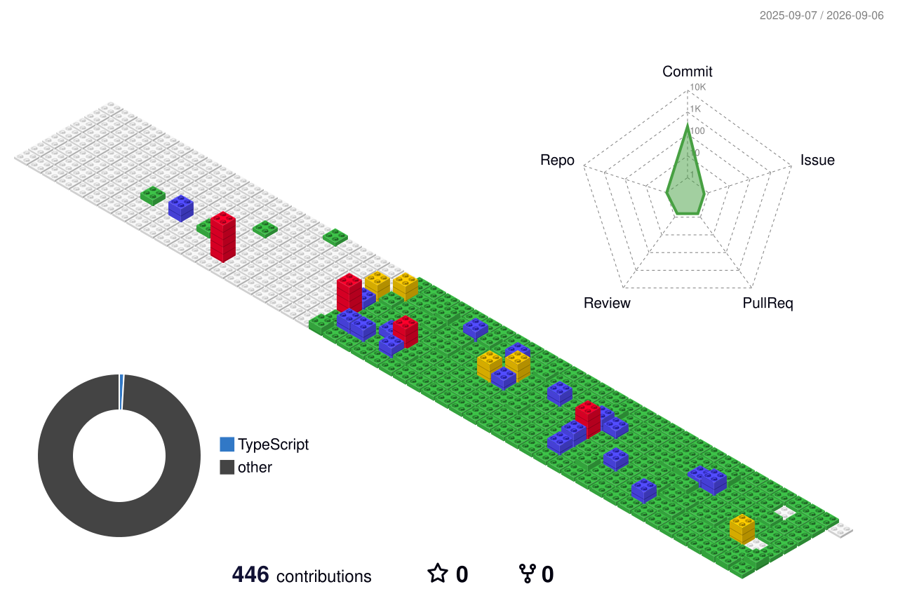

<div align="center">

<picture>
  <source media="(prefers-color-scheme: dark)" srcset=".github/assets/profile-dark.svg">
  <source media="(prefers-color-scheme: light)" srcset=".github/assets/profile-light.svg">
  
</picture>

<br><br>


</div>

<br>

```
████████    ██████████  ██████████  ██            ██████    ██████████  ██████████
██      ██  ██          ██          ██          ██      ██  ██      ██  ██
██      ██  ████████    ██          ██          ██████████  ██████████  ████████
██      ██  ██          ██          ██          ██      ██  ██    ██    ██
████████    ██████████  ██████████  ██████████  ██      ██  ██      ██  ██████████
```

<div align="center"><sub><i>"I DECLARE… <b>BANKRUPTCY!</b>" — Michael Scott, on deploying to production without a backup</i></sub></div>

> **Two colours. No gradients to hide a bad layout behind.**
> I build the whole thing — database, API, interface, the server it dies on at 3 AM.
> Backend that doesn't fall over. Frontend that makes people stop scrolling.

<br>

---

<div align="center">

## ◼ THE SNAKE EATS MY COMMITS

<picture>
  <source media="(prefers-color-scheme: dark)" srcset="https://raw.githubusercontent.com/fontesdev/fontesdev/output/snake-dark.svg">
  <source media="(prefers-color-scheme: light)" srcset="https://raw.githubusercontent.com/fontesdev/fontesdev/output/snake-light.svg">
  
</picture>

<sub>regenerated every 12h by GitHub Actions · monochrome, obviously</sub>

</div>

<br>

---

## ◼ WHAT I ACTUALLY BUILD

| ◼ | Domain | Reality check |
|:--|:--|:--|
| **01** | **Business platforms** | CRMs, ERPs, multi-tenant SaaS. Laravel + Next.js. The unglamorous stuff that runs companies. |
| **02** | **Interfaces** | Next.js · React · WebGL/GLSL · GSAP. Design systems with tokens, not vibes. |
| **03** | **Commerce** | WooCommerce, PrestaShop, Portuguese payments (MB WAY / Multibanco) and invoicing. |
| **04** | **Hardware** | ESP32 fleets talking MQTT to Laravel workers. Firmware that has to survive a factory floor. |
| **05** | **Native** | Swift / SwiftUI — iOS and macOS. No wrapper, no webview. |
| **06** | **Infra** | VPS, nginx, Caddy, SSL, CI/CD, and the pager that follows. |

<br>

---

<div align="center">

## ◼ RECEIPTS

<picture>
  <source media="(prefers-color-scheme: dark)" srcset=".github/assets/stats-dark.svg">
  <source media="(prefers-color-scheme: light)" srcset=".github/assets/stats-light.svg">
  
</picture>

<sub>rendered by <code>.github/scripts/build-stats.py</code> straight off the GitHub GraphQL API, twice a day.<br>
no github-readme-stats, no rate limits, no broken image when someone else's Vercel goes down.</sub>

</div>

<br>

---

## ◼ STACK — no icon soup, just the truth

```
BACKEND    ██████████████████  Laravel · PHP 8 · Node/Express · MySQL · PostgreSQL · Redis
FRONTEND   ██████████████████  Next.js · React · TypeScript · Tailwind · GSAP · Three.js
NATIVE     ███████████         Swift · SwiftUI · SwiftData · Flutter
EMBEDDED   ████████            ESP32 · C++/Arduino · MQTT
INFRA      ██████████████      nginx · Caddy · Docker · Ploi · cPanel · GitHub Actions
CMS        ██████████          WordPress · WooCommerce · Filament · PrestaShop
```

<br>

<details>
<summary><b>◼ HOW I WORK — open if you're about to hire me</b></summary>

<br>

```
┌─ 01 ── SHIP > PLAN ──────────────────────────────────────────┐
│  If it's reversible, it's already done. Planning is for the  │
│  things you can't undo.                                      │
├─ 02 ── SURGICAL ─────────────────────────────────────────────┤
│  Touch what's broken. "While I was in there" is how you get  │
│  a three-day regression.                                     │
├─ 03 ── NO MAGIC ─────────────────────────────────────────────┤
│  Abstractions cost more than duplication until proven        │
│  otherwise. One clear file beats five organised ones.        │
├─ 04 ── IT RUNS OR IT DOESN'T ────────────────────────────────┤
│  "Should work" isn't a status. Open the browser. Read the    │
│  log. Hit the endpoint.                                      │
└──────────────────────────────────────────────────────────────┘
```

</details>

<details>
<summary><b>◼ THE 3D VERSION OF MY YEAR</b></summary>

<br>

<div align="center">
  
</div>

</details>

<details>
<summary><b>◼ HONEST COMMIT HISTORY</b></summary>

<br>

| Message | Translation |
|:--|:--|
| `fix` | I don't want to talk about it 🤫 |
| `final v2 FINAL` | It was not final |
| `works on my machine` | A prophecy, not an excuse |
| `refactor` | Same behaviour, cleaner conscience |

</details>

<br>

---

<div align="center">

## ◼ TALK

[](https://fontesdev.pt)

[](https://github.com/fontesdev)

<br>

```
▛▀▀▀▀▀▀▀▀▀▀▀▀▀▀▀▀▀▀▀▀▀▀▀▀▀▀▀▀▀▀▀▀▀▀▀▀▀▀▀▀▀▀▀▜
   BUILT IN THE DARK. LOOKS FINE IN THE LIGHT.
▙▄▄▄▄▄▄▄▄▄▄▄▄▄▄▄▄▄▄▄▄▄▄▄▄▄▄▄▄▄▄▄▄▄▄▄▄▄▄▄▄▄▄▄▟
```


</div>
